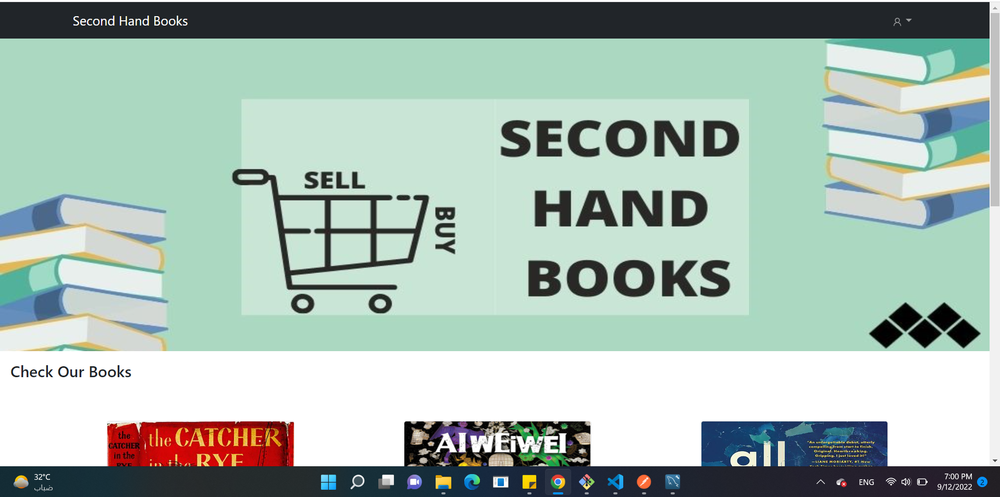
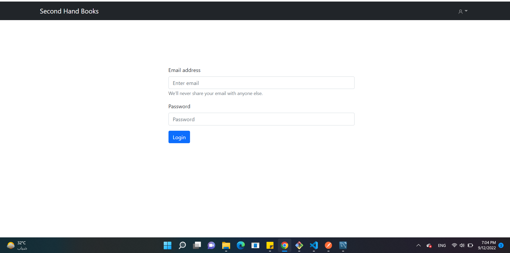
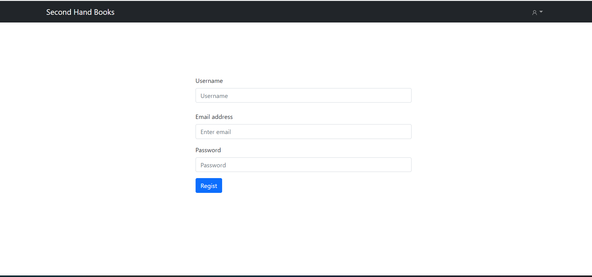
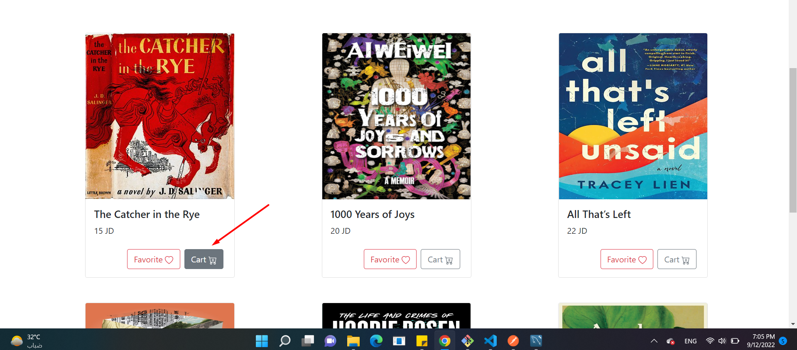
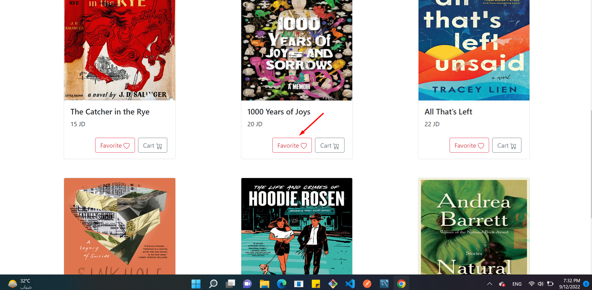
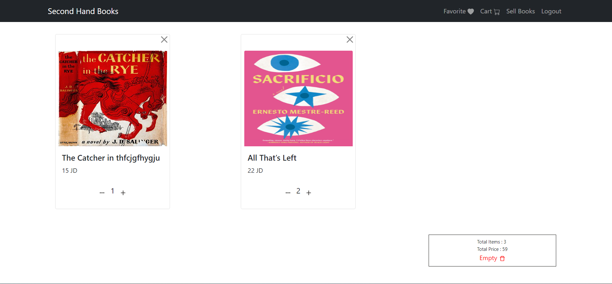
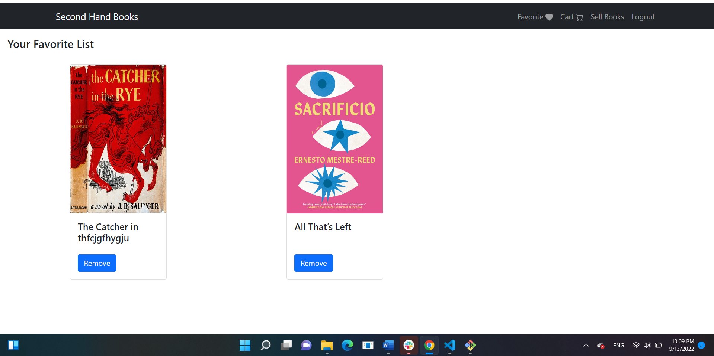
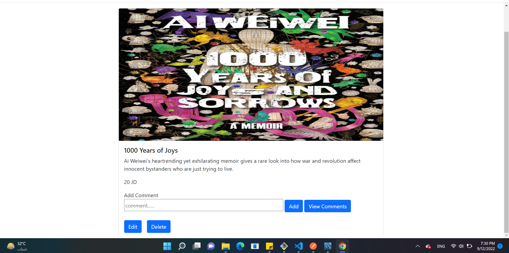
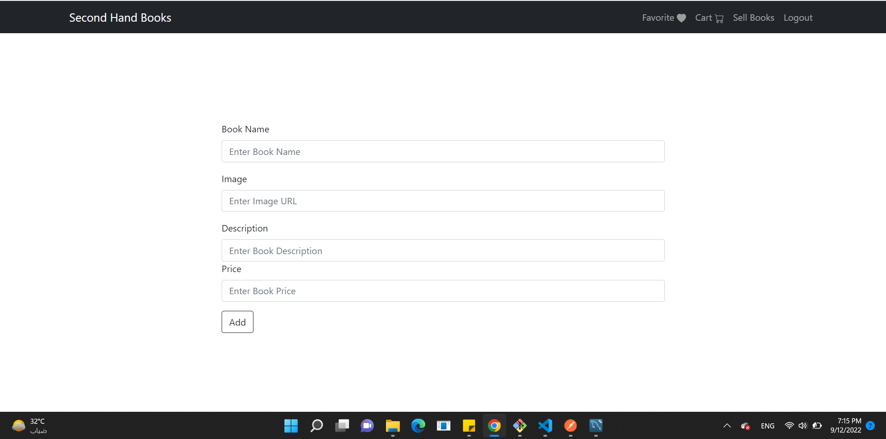
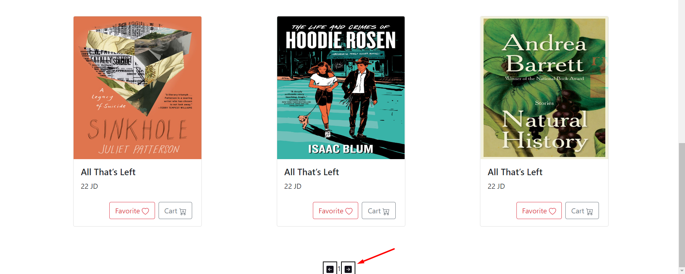

  

<h3 align="center">Second Hand Books</h3>

---

 An online bookshop website was developed to help customers to buy and sell books .
      

## 📝 Table of Contents

- [About](#about)
- [Getting Started](#getting_started)
- [Usage](#usage)
- [Built Using](#built_using)

## 🧐 About 

 An online responsive bookshop website which name is Second Hand Books was developed to help readers to buy and sell books which are used.

## 🏁 Getting Started 

These instructions will get you a copy of the project up and running on your local machine for development and testing purposes.

### Prerequisites

- VS code <a href="https://code.visualstudio.com/download">download from here</a>
- Git Bash <a href="https://git-scm.com/">download from here</a>
- MySQL <a href="https://dev.mysql.com/downloads/installer/">download from here</a>
- Node.js <a href="https://nodejs.org/en/download/">download from here</a>

### Installing

1. clone the repo to your local machine using git bash.
   git clone https://github.com/C5-MarahShihadeh/Agents-On-Cloud-Task.git

2. install packages repeat this step in backend and frontend folder
   npm i

3. Run the server using git bash inside backend folder
   npm run dev

4. Run application using git bash inside frontend folder
   npm run start

Now App ready to use

## 🎈 Usage 

* you don't have to register to navigate our web app.

* you can click on the logo provided in the navigation bar to view the home section
  

* you can click on add to cart button to add this product to your cart but you have to be one of our users, so you should craete an account.
  if you have account =>
  
    if you dont have account=>
  
  add to Cart=>
  
 add to favorite=>
  

* you can view book in cart and increase and decrease amount and empty the whole books in cart if you want and you will see the total price.
      

* you can view book in favorite and remove it.
      

* you can view  more details about book by clicking on the image of the book and if the book was yours you can update or delete or add comment.
      

* To Add book click at sell book in the Navbar.
  

* There is a pagination in the website each page limit for 6 books
  

## ⛏️ Built Using 

- [MySQL](https://dev.mysql.com/downloads/installer//) - Database
- [Express JS](https://expressjs.com/) - Server Framework
- [React JS](https://https://reactjs.org/) - Web Framework
- [Node JS](https://nodejs.org/en/) - Server Environment

